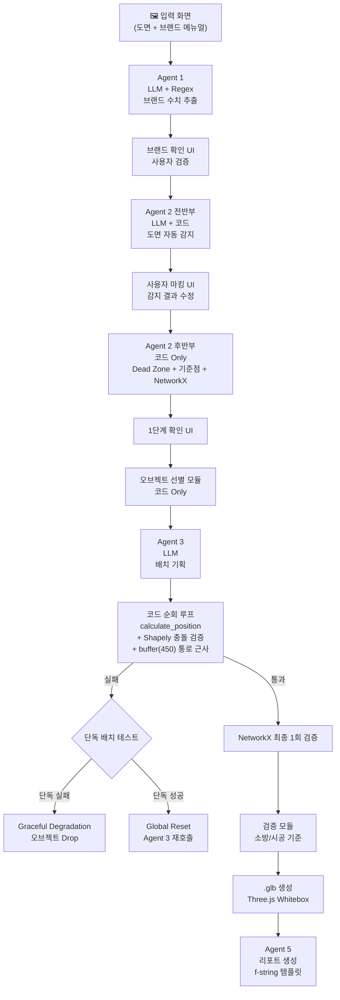
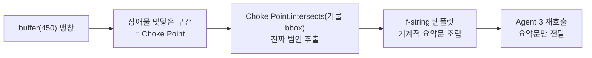

# LandingUp 아키텍처 팀 브리핑 문서

> 작성 기준: 2026-04-01 | 원본: [architecture_spec.md](file:///c:/simhwa/rendy/architecture_spec.md), [architecture_decisions.md](file:///c:/simhwa/rendy/architecture_decisions.md)

---

## 1. 프로젝트 한줄 요약

**AI 기반 팝업스토어 레이아웃 자동 생성기** — 도면과 브랜드 메뉴얼을 입력하면, AI Agent가 기획하고 코드가 수학적으로 검증하여 3D 배치 결과(.glb)를 출력한다.

---

## 2. 핵심 설계 원칙

```
┌─────────────────────────────────────────────────────────────┐
│  LLM은 "방향과 기획"만 결정한다. 좌표와 수치는 출력할 수 없다. │
│  코드가 space_data에서 직접 수치를 읽어 계산한다.              │
│  배치와 검증은 오브젝트 단위로 즉시 수행한다.                  │
│  실패는 원인을 수학적으로 판정한 후 분기한다.                  │
└─────────────────────────────────────────────────────────────┘
```

> [!IMPORTANT]
> **LLM ↔ 코드 역할 분리가 이 아키텍처의 가장 핵심적인 설계 철학입니다.**
> - LLM(Agent 3)은 `zone_label`(어느 구역에 놓을지)만 결정
> - 실제 좌표 계산, 충돌 검증, 통로 확보는 전부 Shapely/NetworkX 코드가 처리
> - 이렇게 하면 LLM 환각으로 인한 수치 오류를 구조적으로 차단

---

## 3. 전체 파이프라인 흐름



---

## 4. 각 모듈 상세

### 4.1 Agent 1 — 브랜드 수치 추출

| 항목 | 내용 |
|------|------|
| **역할** | 브랜드 메뉴얼 PDF에서 수치/규정 추출 |
| **LLM 역할** | 라벨링만 (이 숫자가 어떤 규정인지 분류) |
| **코드 역할** | 텍스트 PDF → Python Regex로 숫자/단위 기계 추출 |
| **Input** | 브랜드 메뉴얼 PDF |
| **Output** | `space_data["brand"]` (clearspace_mm, relationships 등) |

> [!NOTE]
> 이미지 PDF는 Claude Vision으로 처리. 텍스트 PDF와 이미지 PDF를 분기 처리하는 이유는 LLM 환각 방지 — 텍스트에서 숫자를 직접 Regex로 뽑으면 400mm를 4000mm로 잘못 읽는 문제를 원천 차단.

**추출 대상 5가지:**
1. `clearspace_mm` — 이격/여백 수치
2. `character_orientation` — 배치 방향 규정
3. `prohibited_material` — 금지 소재
4. `logo_clearspace_mm` — 로고 여백
5. `relationships` — 관계 제약 (자연어 그대로 보존)

---

### 4.2 Agent 2 전반부 — 도면 자동 감지

| 항목 | 내용 |
|------|------|
| **역할** | 도면에서 바닥, 입구, 설비 위치 자동 감지 |
| **LLM 역할** | Claude Vision으로 입구/스프링클러/소화전/분전반 감지 |
| **코드 역할** | OpenCV → 바닥 polygon, OCR → 치수선 → 스케일 계산 |
| **Input** | 도면 파일 + space_data |
| **Output** | `auto_detected` dict (임시, 확정 아님) |

---

### 4.3 사용자 마킹 UI

- 자동 감지 결과를 사용자가 확인/수정
- 미감지 설비 직접 추가 가능
- "모르겠음" 선택 → `disclaimer` 등록 (면책)
- **이 단계에서 도면 관련 모든 입력이 확정됨**

---

### 4.4 Agent 2 후반부 — Dead Zone + 기준점 + NetworkX

| 항목 | 내용 |
|------|------|
| **역할** | 사용자 수정 반영 후 최종 공간 데이터 계산 |
| **LLM 역할** | 없음 (순수 코드) |
| **처리 순서** | ① 픽셀→mm 변환 → ② Dead Zone 생성 → ③ reference_point 좌표/wall_linestring/wall_normal 계산 → ④ zone polygon 경계 생성 → ⑤ NetworkX 격자 그래프 + 보행 거리 → ⑥ Agent 3용 자연어 요약 |
| **Output** | `space_data` 확정 저장 (코드용 수치 + Agent 3용 자연어 이중 구조) |

> [!IMPORTANT]
> **이중 소비 구조**: 같은 데이터를 코드용(수치)과 LLM용(자연어) 두 형태로 동시에 저장. 코드는 수치를 직접 읽고, Agent 3은 자연어 요약만 읽는다.

---

### 4.5 오브젝트 선별 모듈

- `space_data` + Supabase `furniture_standards` 테이블 조회
- bbox(바운딩 박스) 포함, 공간 미달/브랜드 금지 오브젝트 제외
- 결과: `eligible_objects` 리스트

---

### 4.6 Agent 3 — 배치 기획 (핵심 LLM Agent)

| 항목 | 내용 |
|------|------|
| **역할** | 어떤 오브젝트를 어느 구역에, 어떤 방향으로 놓을지 기획 |
| **Input** | zone 자연어 요약, eligible_objects, 관계 제약, 허용 zone 목록, (실패 시) 실패 컨텍스트 |
| **Output** | Pydantic 강제 스키마 — 아래 참조 |

```python
class Placement(BaseModel):
    object_type: str                                          # 오브젝트 종류
    zone_label: str                                           # 어느 구역 (좌표 아님!)
    direction: Literal["wall_facing", "inward", "center"]     # 배치 방향
    priority: int                                             # 우선순위
    placed_because: str                                       # 기획 의도 (서비스 핵심 상품성)
```

> [!WARNING]
> Agent 3은 **절대 좌표/mm 값을 출력하지 않음**. `zone_label`만 출력하고, 실제 좌표는 `calculate_position` 함수가 계산. Pydantic 스키마 검증 실패 시 최대 3회 재시도 → 전부 실패하면 파이프라인 중단 (Circuit Breaker).

---

### 4.7 코드 순회 루프 + 배치 검증

Agent 3의 기획을 실제 좌표로 변환하고 검증하는 핵심 루프:

```
Agent 3가 zone_label 지정
    ↓
해당 zone 안의 reference_point 전체를 격자 순회
    ├→ calculate_position (좌표 계산)
    ├→ zone_polygon.contains() 선행 체크 (zone 이탈 즉시 skip)
    ├→ Shapely 충돌 체크
    └→ buffer(450) 통로 근사 검증
         ├─ 통과 → NetworkX 최종 1회 검증 → 확정 ✅
         └─ 실패 → 다음 reference_point로
    ↓
전체 순회 전부 실패
    ↓
단독 배치 테스트 (빈 도면에 해당 오브젝트만)
    ├─ 단독 실패 = 물리적 한계 → 오브젝트 Drop (Graceful Degradation)
    └─ 단독 성공 = cascade failure → Global Reset → Agent 3 재호출
```

**주요 계산 방식:**
- `step_mm = √(w² + d²) × ratio` — 오브젝트 대각선에 비례하는 탐색 보폭
- 격자점: bounding box 안에 step_mm 간격 생성 → contains 필터 → 벽 거리 오름차순
- 격자점 0개 시: zone 중앙 + 양 끝 3점 fallback

---

### 4.8 cascade failure 처리 — Global Reset



> [!TIP]
> **LLM이 요약문을 '생성'하는 게 아니라 '읽기만' 함** → 수치 환각 원천 차단. 재호출 시 실패한 zone을 누적 전달하므로 시도 가능한 zone이 점점 줄어들어 자연 종료.

---

### 4.9 검증 모듈

**.glb 출력 차단(blocking) 기준:**
- 소방 통로 900mm 미달
- 비상 대피로 1200mm 미달
- Dead Zone 침범

위 조건 해당 시 .glb 생성 차단. 아니면 통과.

---

### 4.10 .glb 생성 + Agent 5 리포트

| 모듈 | 내용 |
|------|------|
| **.glb 생성** | layout_objects + DB 높이값 → Three.js Whitebox 3D → .glb 파일 |
| **Agent 5** | dict + placements + 검증 결과 → **f-string 템플릿**으로 기계 조립 (LLM 아님) |

리포트 포함 내용:
- source별 수치 표기 (브랜드 메뉴얼 / 기본값 / 사용자 입력)
- `placed_because` (Agent 3의 기획 의도)
- 코드 자동 조정 이력
- 배치 불가 오브젝트 목록 + 사유
- 면책 조항 (disclaimer)

---

## 5. 핵심 데이터 구조 — space_data

**단일 Python dict**가 전체 파이프라인의 유일한 데이터 저장소.

```python
space_data = {
    # ── 공간 수치 (코드용) ──
    "floor": {
        "polygon": Polygon(...),         # Shapely Polygon
        "usable_area_sqm": 36.0,         # 가용 면적
        "max_object_w_mm": 2000          # 최대 오브젝트 너비
    },

    # ── 기준점 (코드용 + Agent 3용) ──
    "north_wall_mid": {
        "x_mm": 2300,
        "y_mm": 3800,
        "wall_linestring": LineString([(0,4000),(6000,4000)]),
        "wall_normal": "south",
        "zone_label": "mid_zone",
        "shelf_capacity": 3
    },

    # ── zone 경계 ──
    "mid_zone": {
        "boundary": Polygon([(x1,y1), ...])
    },

    # ── 브랜드 제약 ──
    "brand": {
        "clearspace_mm": {"value": 1500, "confidence": "high", "source": "manual"},
        "relationships": [{"rule": "라이언과 춘식이를 떨어뜨릴 것", "confidence": "high"}]
    },

    # ── 소방/시공 기준 (하드코딩) ──
    "fire": {"main_corridor_min_mm": 900, "emergency_path_min_mm": 1200},
    "construction": {"wall_clearance_mm": 300},

    # ── 면책 ──
    "infra": {"disclaimer": ["electrical_panel"]}
}
```

> [!NOTE]
> **브랜드 필드 포맷 규칙**: 항상 `{"value": ..., "confidence": "high|medium|low", "source": "manual|default|user_corrected"}` 래핑. 추출 실패 시 `null` — 추측 금지. DEFAULTS dict로 merge 후 `source: "default"` 기록.

---

## 6. 실패 처리 전략 요약표

| 실패 유형 | 원인 | 처리 |
|-----------|------|------|
| **추출 실패** (Agent 1) | PDF에서 수치 추출 실패 | `null` 저장 → DEFAULTS merge |
| **감지 실패** (Agent 2) | 도면에서 설비 미감지 | 사용자 마킹 UI에서 수동 추가 or disclaimer |
| **스키마 실패** (Agent 3) | Pydantic 검증 실패 | 최대 3회 재시도 → 파이프라인 중단 |
| **배치 실패 — 물리적 한계** | 공간이 오브젝트를 수용 불가 | 단독 배치 테스트 실패 → 오브젝트 drop |
| **배치 실패 — cascade** | 선행 오브젝트가 통로 선점 | Global Reset + Choke Point 원인 추출 → Agent 3 재호출 |
| **관계 제약 위반** | 분리해야 할 오브젝트가 같은 zone | zone_label 비교 → Agent 3 재호출 |

---

## 7. 주요 설계 의사결정 요약

| # | 결정 | 왜? |
|---|------|-----|
| 1 | Regex + LLM hybrid (Agent 1) | LLM 단독은 숫자 환각 위험 |
| 2 | Agent 3 → zone_label만 출력 | 좌표를 LLM에 맡기면 환각 + API 비용 폭발 |
| 3 | Global Reset (cascade) | 원인 오브젝트만 제거(Targeted Removal)는 NetworkX가 역추적 불가 |
| 4 | Choke Point intersects | 거리 기반 탐색은 도면 크기에 종속 → 교차 기반으로 전환 |
| 5 | buffer(450) 근사 + NetworkX 최종 1회 | step마다 NetworkX 전체 재연산은 서버 다운 |
| 6 | 사전 분석 레이어 **기각** | 정확한 분석 = 본 배치와 동일 연산 낭비, 근사치는 거짓 정보 주입 |
| 7 | CSP 브루트포스 **기각** | `placed_because`(기획 의도) 소멸 → 서비스 핵심 상품성 파괴 |
| 8 | 벽 표현: LineString + 수선의 발 | 단일 좌표(wall_surface_y)는 사선/곡선 벽 대응 불가 |

---

## 8. 파일 파서 확장 구조

새로운 도면 형식 추가 시 Agent 2 이후 코드를 건드리지 않도록 어댑터 패턴 적용:

```
FloorPlanParser (추상)
  └── DWGParser    ← DXF via ezdxf
  └── PDFParser    ← 래스터화 후 Vision 파이프라인
  └── ImageParser  ← OpenCV + Claude Vision
```

모든 파서는 `ParsedFloorPlan` 공통 스키마로 정규화 후 Agent 2에 전달.

---

## 9. 미결 사항 (실제 도면 테스트 후 결정)

| 항목 | 내용 | 영향 |
|------|------|------|
| `step_mm ratio` | `√(w²+d²) × ratio`의 ratio 수치 | 탐색 보폭 — 너무 작으면 과도한 루프, 너무 크면 최적점 건너뜀 |
| 소형/대형 공간 기준선 | `usable_area_sqm` 분기 수치 | zone 분할/순회 전략 분기 |
| inward 오프셋 규칙 | reference_point에서 entrance 방향 오프셋량 | 오브젝트 크기 확인 필요 |
| center 오프셋 규칙 | reference_point에서 floor center 방향 오프셋량 | 오브젝트 크기 확인 필요 |

> [!CAUTION]
> 이 4개 미결 항목이 확정되기 전까지는 배치 루프 전체의 동작 검증이 불가능합니다. 단순 수치 미결이 아니라 구조 검증 블로커입니다.

---

## 10. 프로젝트 파일 구성

| 파일 | 역할 |
|------|------|
| [architecture_spec.md](file:///c:/simhwa/rendy/architecture_spec.md) | 아키텍처 명세 (구현 기준 문서) |
| [architecture_decisions.md](file:///c:/simhwa/rendy/architecture_decisions.md) | 의사결정 기록 (Issue 1~14 + 기각 이유) |
| [architecture_review.md](file:///c:/simhwa/rendy/architecture_review.md) | 아키텍처 외부 검토 결과 |
| [for_gemini.md](file:///c:/simhwa/rendy/for_gemini.md) | 기존 va 대비 변경 사항 요약 (Gemini 전달용) |
| [claude.md](file:///c:/simhwa/rendy/claude.md) | Claude 코딩 에이전트용 프로젝트 규칙 (하네스) |
| [task_plan.md](file:///c:/simhwa/rendy/task_plan.md) | 현재 진행 상태 + 다음 작업 |
| [progress.md](file:///c:/simhwa/rendy/progress.md) | 세션별 진행 로그 |
| `old/` | 이전 버전 문서 (참고용) |

---

## 11. 현재 상태

> **아키텍처 설계 완료 → 구현 미시작**

다음 단계: P0 구현 시작 (명시적 지시 후 진행)
- P0-1: dict 모듈 + space_data 스키마
- P0-2: Agent 2 전반부 (OpenCV + Vision)
- P0-3: Agent 2 후반부 (Dead Zone + NetworkX + LineString)
- P0-4: Agent 1 (Regex + LLM 라벨링)
- P0-5: Agent 3 + calculate_position + 코드 순회
- P0-6: 검증 모듈 + Graceful Degradation
- P0-7: .glb 생성 + Agent 5 리포트
