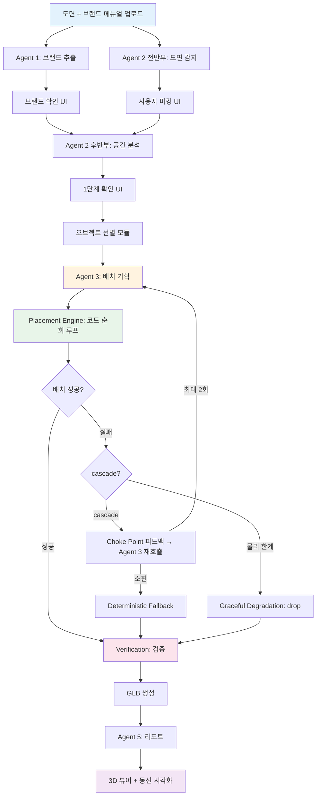
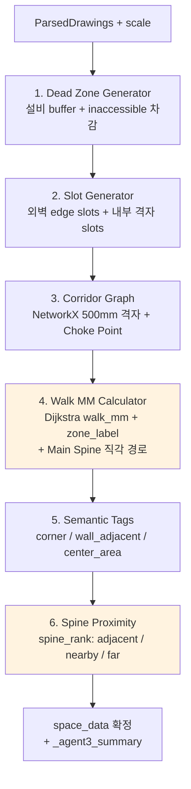
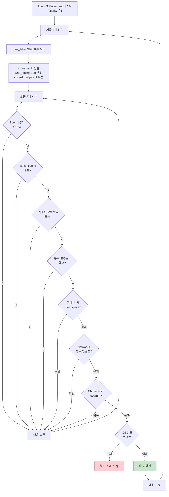
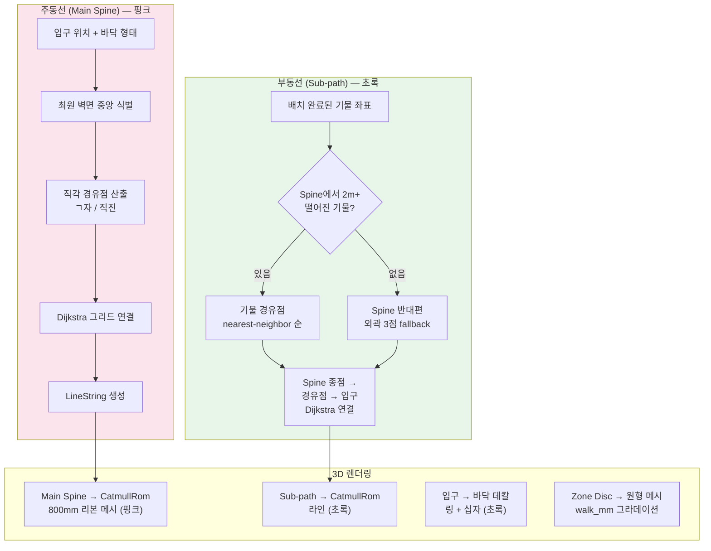
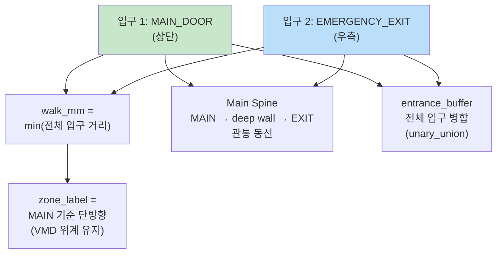
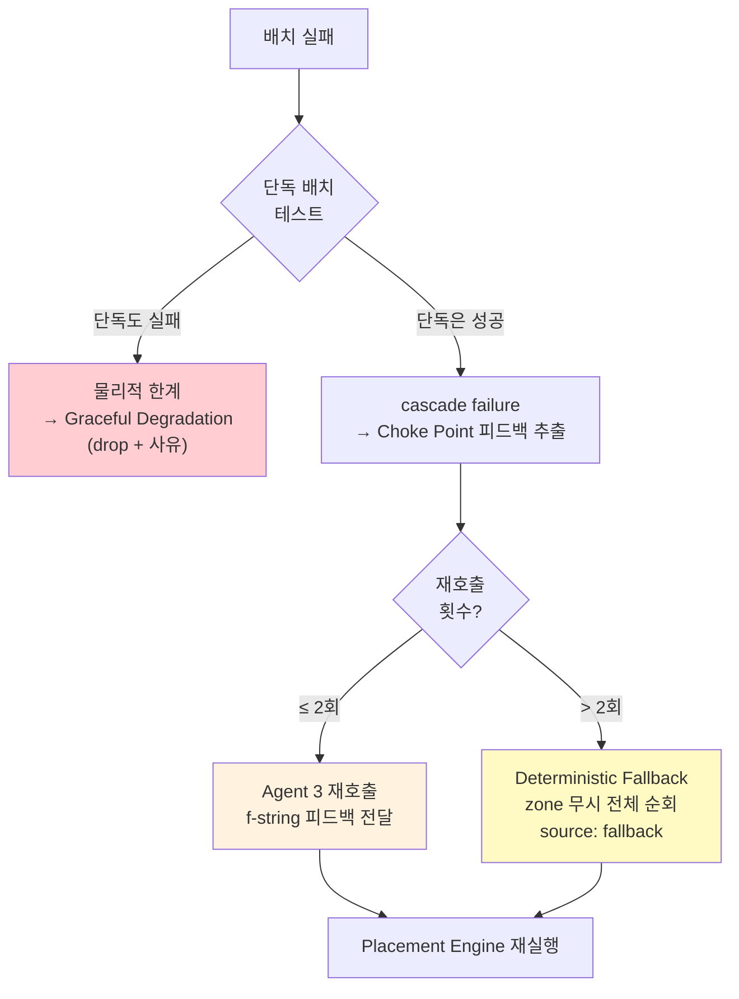
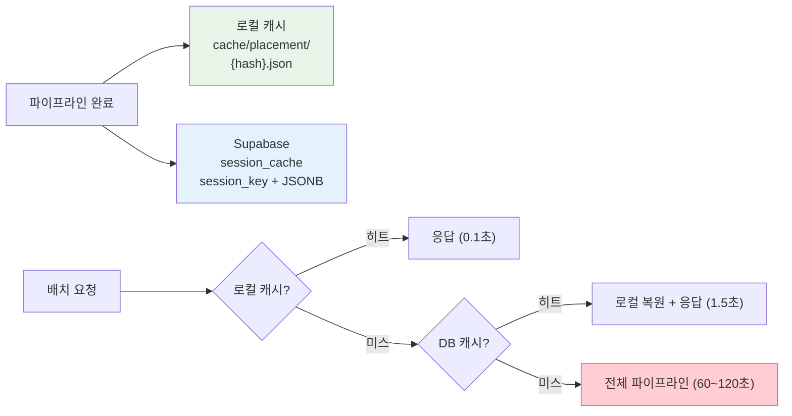

# Rendy 파이프라인 아키텍처

> 최종 갱신: 2026-04-07

---

## 전체 파이프라인 흐름



---

## Agent별 역할과 I/O

```mermaid
flowchart LR
    subgraph Agent1["Agent 1 — 브랜드 추출"]
        A1_IN["PDF 바이트"] --> A1_PROC["Regex 수치 추출\n+ LLM 라벨링"]
        A1_PROC --> A1_OUT["brand_data\nclearspace_mm\nprohibited_material\nobject_pair_rules"]
    end

    subgraph Agent2F["Agent 2 전반부 — 도면 감지"]
        A2F_IN["도면 파일"] --> A2F_PROC["파서 어댑터\nDXF/PDF/Image\n+ Claude Vision"]
        A2F_PROC --> A2F_OUT["ParsedDrawings\nfloor_polygon_px\nentrances\nsprinklers\nfire_hydrant\nelectrical_panel"]
    end

    subgraph Agent2B["Agent 2 후반부 — 공간 분석 (코드)"]
        A2B_IN["ParsedDrawings\n+ scale_mm_per_px"] --> A2B_PROC["6개 모듈 순차 실행"]
        A2B_PROC --> A2B_OUT["space_data dict\n2500+ slots\nwalk_mm\nzone_label\nspine_rank\nMain Spine"]
    end

    subgraph Agent3["Agent 3 — 배치 기획 (LLM)"]
        A3_IN["공간 요약 50줄\n+ Spine 구조\n+ eligible 기물\n+ 브랜드 제약"] --> A3_PROC["Claude Sonnet 4.5\nP1~P4 규칙\nCircuit Breaker 3회"]
        A3_PROC --> A3_OUT["Placement[]\nzone_label\ndirection\npriority\nalignment\nplaced_because"]
    end

    subgraph Agent5["Agent 5 — 리포트 (템플릿)"]
        A5_IN["배치 결과\n+ 검증 결과"] --> A5_PROC["f-string 템플릿\n기계 조립"]
        A5_PROC --> A5_OUT["마크다운 리포트"]
    end

    style Agent1 fill:#e3f2fd
    style Agent2F fill:#e8f5e9
    style Agent2B fill:#e8f5e9
    style Agent3 fill:#fff3e0
    style Agent5 fill:#f3e5f5
```



---

## Agent 2 후반부 — 6개 모듈 상세



---

## Placement Engine — 배치 순회 루프



---

## 동선 시스템



---

## 복수 입구 처리



---

## 실패 처리 계층



---

## 세션 영속화



---

## 기술 스택

| 계층 | 기술 |
|------|------|
| Frontend | React + Vite + TypeScript + Three.js (R3F + drei) |
| Backend | FastAPI + Python 3.12 |
| AI | Claude Sonnet 4.5 (Agent 1, 2 전반부, 3) |
| 기하학 | Shapely (충돌/buffer) + NetworkX (경로/통로) |
| 3D 출력 | trimesh (GLB) + InstancedMesh (프론트) |
| DB | Supabase (furniture_standards + session_cache) |
| 파서 | ezdxf (DXF) + pdfplumber (PDF) + OpenCV + Vision (Image) |

---

## 파일 구조 (37 Python 파일)

```
backend/app/
├── agents/
│   ├── agent1_brand.py          # Agent 1: 브랜드 추출
│   ├── agent2_back.py           # Agent 2 후반부: 오케스트레이터
│   ├── agent2_summary.py        # Agent 3용 요약 생성
│   ├── agent3_placement.py      # Agent 3: LLM 배치 기획
│   ├── corridor_graph.py        # NetworkX 격자 + Choke Point
│   ├── dead_zone_generator.py   # Dead Zone 생성
│   ├── slot_generator.py        # 슬롯 생성 (edge + interior)
│   └── walk_mm_calculator.py    # walk_mm + Main Spine
├── api/
│   ├── routes.py                # FastAPI 라우터
│   ├── pipeline.py              # 파이프라인 오케스트레이터
│   ├── cache_service.py         # 로컬 캐시
│   ├── session_store.py         # Supabase 세션 영속화
│   ├── file_converter.py        # DXF→PNG 프리뷰
│   ├── object_crud.py           # furniture_standards CRUD
│   └── serializer.py            # Shapely → JSON
├── modules/
│   ├── placement_engine.py      # 배치 엔진 (코드 순회)
│   ├── calculate_position.py    # 좌표 계산
│   ├── verification.py          # 배치 검증
│   ├── report_generator.py      # Agent 5 리포트
│   ├── glb_exporter.py          # GLB 생성
│   ├── object_selection.py      # IQI + 기물 선별
│   ├── failure_handler.py       # 실패 처리 + fallback
│   ├── failure_classifier.py    # 실패 분류
│   ├── fallback_placement.py    # Deterministic Fallback
│   └── geometry_cache.py        # InstancedMesh geometry_id
├── parsers/
│   ├── base.py                  # FloorPlanParser 추상 클래스
│   ├── dxf_parser.py            # DXF 파서 (ezdxf)
│   ├── dwg_parser.py            # DWG 파서 (ODA 경유)
│   ├── image_parser.py          # Image 파서 (Vision)
│   ├── pdf_parser.py            # PDF 파서
│   └── factory.py               # 파서 팩토리
└── schemas/
    ├── drawings.py              # ParsedDrawings
    ├── placement.py             # Placement
    ├── space_data.py            # space_data 유틸
    ├── verification.py          # SummaryReport
    └── brand.py                 # 브랜드 스키마
```
