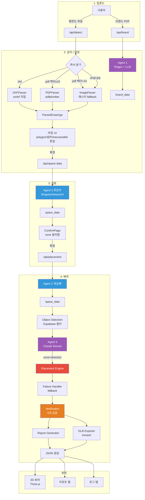
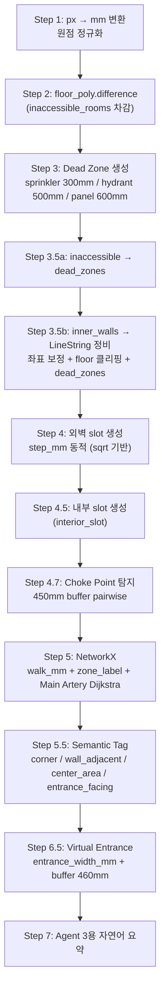
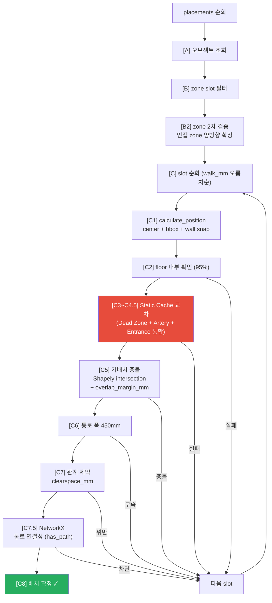
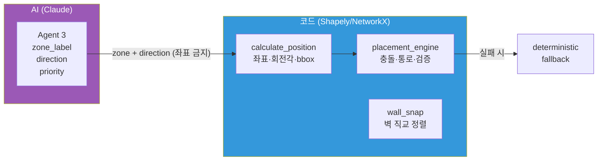
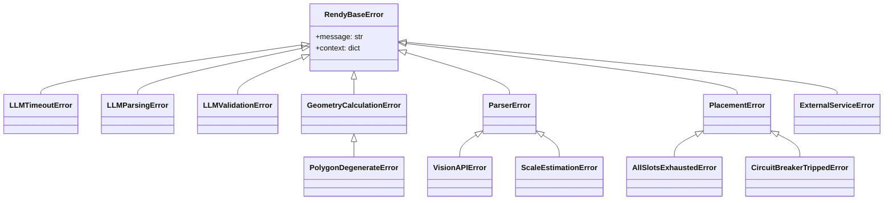

# Rendy — 아키텍처 & 파이프라인 기술 문서

> 팝업스토어 3D 배치 자동화 서비스  
> 최종 갱신: 2026-04-03

---

## 1. 시스템 개요

도면 파일(DXF/PDF/이미지) 1장과 브랜드 메뉴얼 PDF를 입력하면, AI가 소방/시공 규정을 준수하는 오브젝트 배치 초안을 생성하고 3D GLB 파일로 출력하는 서비스.

**핵심 설계 원칙**: LLM은 방향만 결정하고, 좌표는 코드가 계산한다.

---

## 2. 기술 스택

| 계층 | 기술 |
|------|------|
| 백엔드 | FastAPI (Python 3.13) |
| 프론트엔드 | React + Vite + TypeScript |
| 3D 렌더링 | Three.js 0.160 (R3F 8 + drei 9) |
| AI | Claude Sonnet 4.5 (Vision + Text) |
| 기하학 엔진 | Shapely + NetworkX |
| 3D 메시 | trimesh + mapbox-earcut |
| 도면 파싱 | ezdxf (DXF) + pdfplumber (PDF) + OpenCV (이미지) |
| DB | Supabase (furniture_standards) |

---

## 3. 전체 파이프라인 다이어그램



---

## 4. Agent 2 후반부 — space_data 생성 파이프라인



---

## 5. Placement Engine — 배치 루프 상세



---

## 6. I/O 스키마

### 6.1 ParsedDrawings (파서 → Agent 2)

```python
ParsedDrawings:
  floor_plan: ParsedFloorPlan
    floor_polygon_px: list[tuple[float, float]]
    scale_mm_per_px: float
    scale_confirmed: bool
    detected_width_mm: float | None
    detected_height_mm: float | None
    entrance: DetectedPoint | None
    entrance_width_mm: float | None
    sprinklers: list[DetectedPoint]
    fire_hydrant: list[DetectedPoint]
    electrical_panel: list[DetectedPoint]
    inner_walls: list[DetectedLineSegment]
    inaccessible_rooms: list[DetectedPolygon]
  section: ParsedSection | None
    ceiling_height_mm: float | None
  preview_image_base64: str | None  # PDF/DXF 미리보기
```

### 6.2 space_data (Agent 2 → 배치 엔진)

```python
space_data = {
    "floor": {
        "polygon": Shapely Polygon,
        "usable_area_sqm": float,
        "max_object_w_mm": float,
        "ceiling_height_mm": {"value": 3000, "confidence": "...", "source": "..."}
    },
    "{slot_key}": {
        "x_mm": float, "y_mm": float,
        "wall_linestring": LineString,
        "wall_normal": str,
        "zone_label": str,
        "shelf_capacity": int,
        "walk_mm": float,
        "semantic_tags": list[str]
    },
    "dead_zones": list[Shapely Polygon],
    "choke_points": list[Shapely Polygon],
    "fire": {
        "main_corridor_min_mm": 900,
        "emergency_path_min_mm": 1200,
        "main_artery": LineString  # Dijkstra 우회 경로
    },
    "entrance_line": LineString,
    "entrance_buffer": Polygon,
    "exterior_wall_linestrings": list[LineString],
    "inner_wall_linestrings": list[LineString],
    "all_wall_linestrings": list[LineString],
    "_origin_offset_mm": tuple[float, float],
    "_agent3_summary": str
}
```

### 6.3 Placement (Agent 3 → 배치 엔진)

```python
class Placement(BaseModel):
    object_type: str
    zone_label: Literal["entrance_zone", "mid_zone", "deep_zone"]
    direction: Literal["wall_facing", "inward", "center", "outward"]
    priority: int
    rotation_deg: Optional[float]  # 0/90/180/270만 허용 (Pydantic snap)
    placed_because: str            # mm값 금지
    join_with: Optional[str]
```

### 6.4 /api/placement 응답

```python
{
    "placed": list[dict],           # 배치된 오브젝트
    "dropped": list[dict],          # 드랍된 오브젝트
    "verification": {               # VerificationResult
        "passed": bool,
        "blocking": list[ViolationItem],
        "warning": list[ViolationItem],
        "checked_count": int
    },
    "report": str,                  # 텍스트 리포트
    "glb_base64": str,              # GLB 3D 모델
    "log": list[str],               # 배치 로그
    "summary": {                    # SummaryReport
        "total_area_sqm": float,
        "zone_distribution": dict,
        "placed_count": int,
        "dropped_count": int,
        "success_rate": float,
        "fallback_used": bool,
        "slot_count": int,
        "verification_passed": bool
    }
}
```

---

## 7. AI-코드 역할 분리



| 구분 | AI가 결정 | 코드가 계산 |
|------|----------|------------|
| 위치 | zone_label (entrance/mid/deep) | center_x_mm, center_y_mm |
| 방향 | direction (wall_facing/inward/center) | rotation_deg (wall snap) |
| 우선순위 | priority | 배치 순서 |
| 회전 | 0/90/180/270 (프롬프트 제약) | 최근접 벽 직교 snap |
| 기획 의도 | placed_because (서사) | adjustment_log (코드 보정) |
| 충돌 | - | Shapely intersection |
| 통로 | - | NetworkX has_path |

---

## 8. 검증 항목 (Verification)

| # | 항목 | 기준 | 분류 |
|---|------|------|------|
| 1 | floor polygon 이탈 | bbox 95% 이상 내부 | blocking |
| 2 | Dead Zone 침범 | intersects | blocking |
| 3 | Main Artery | 1200mm buffer | blocking |
| 4 | 오브젝트 간 통로 | 900mm 이상 | warning |
| 5 | 벽체 이격 | 300mm 이상 (wall_facing 제외) | warning |

---

## 9. Exception Class 구조



| 예외 | HTTP | 용도 |
|------|------|------|
| LLMTimeoutError | 502 | Claude API 타임아웃 |
| LLMParsingError | 502 | LLM 응답 JSON 파싱 실패 |
| LLMValidationError | 422 | Pydantic 검증 실패 |
| ParserError | 422 | 도면 파싱 실패 |
| PlacementError | 500 | 배치 엔진 오류 |
| ExternalServiceError | 503 | Supabase 등 외부 서비스 |

---

## 10. 파일 구조

```
backend/
  main.py                              # FastAPI 엔트리포인트
  app/
    api/routes.py                      # 8개 엔드포인트
    agents/
      agent1_brand.py                  # 브랜드 메뉴얼 추출
      agent2_back.py                   # 도면 → space_data (781줄)
      agent3_placement.py              # LLM 배치 기획
    modules/
      placement_engine.py              # 배치 루프 + Static Cache (434줄)
      calculate_position.py            # 좌표 계산 + Wall Snap (352줄)
      failure_handler.py               # cascade 분류 + fallback (305줄)
      verification.py                  # 5대 검증
      report_generator.py              # f-string 리포트
      glb_exporter.py                  # trimesh → GLB
      object_selection.py              # Supabase 필터
    parsers/
      factory.py                       # 확장자 분기
      dxf_parser.py                    # ezdxf
      pdf_parser.py                    # pdfplumber 벡터 + 래스터 fallback
      image_parser.py                  # OpenCV + Claude Vision
    schemas/
      drawings.py                      # ParsedDrawings
      placement.py                     # Placement (rotation snap)
      space_data.py                    # SpaceData TypedDict
      brand.py                         # BrandField
      verification.py                  # VerificationResult + SummaryReport
    core/
      defaults.py                      # DEFAULTS dict
      exceptions.py                    # 11개 Exception Class

frontend/
  src/
    App.tsx                            # 4단계 탭 라우팅
    api/
      detect.ts                        # /api/detect 호출
      placement.ts                     # /api/placement 호출 + 타입
      layout.ts                        # PATCH /layout 호출
    components/
      upload/UploadPage.tsx            # 파일 업로드
      marking/MarkingPage.tsx          # 인터랙티브 마킹 (654줄)
      confirm/ConfirmPage.tsx          # zone 컬러맵
      placement/PlacementPage.tsx      # 결과 탭 (3D/리포트/로그)
      viewer/SceneViewer.tsx           # Three.js 뷰어 (281줄)
    hooks/
      useDragControls.ts              # Three.js 드래그
```

---

## 11. 설계 원본 대비 현재 구현 차이

### 의도적 변경 (8건)

| # | 설계 원본 | 현재 구현 | 변경 사유 | 복원 계획 |
|---|----------|----------|----------|----------|
| 1 | Global Reset 2회 + Agent 3 재호출 | 즉시 deterministic fallback | API 비용 + 동일 조건 재시도 무의미 | Phase 3-2에서 Choke Point 피드백 기반 복원 |
| 2 | Zone을 Shapely Polygon으로 저장 | walk_mm 임계값 기반 동적 경계 | Issue 16 의도적 대체. 비정형 공간 대응 | 영구 변경 (설계보다 유연) |
| 3 | Zone 경계 고정값 (0-400/400-700/700+mm) | 공간 비례 동적 (bbox 최대변 × 33%/66%) | 공간 크기마다 달라서 고정값 불가 | 영구 변경 |
| 4 | rotation_deg 자유 (0~359) | 직교 강제 (0/90/180/270) + wall snap | LLM 임의 각도 환각 방지 | Phase 3-1에서 사선 벽 지원 시 해제 |
| 5 | MeshStandardMaterial (PBR) | MeshBasicMaterial | Three.js 0.160 조명 호환 미해결 | Phase 4-3에서 재시도 |
| 6 | step_mm ratio "테스트 후 결정" | 0.7 하드코딩 | 설계에서 미결이었으므로 임시 확정 | Phase 4-5 실측 후 조정 |
| 7 | NetworkX 확정 시 1회만 검증 | 매 배치마다 반복 검증 | 보수적 방어 (롤백 비용 절감) | 성능 문제 시 조정 |
| 8 | Choke Point → f-string → Agent 3 재호출 | Choke Point → dead zone 차단 | Agent 3 재호출 폐기와 연동 | Phase 3-2에서 함께 복원 |

### 설계 원본과 일치하는 핵심 항목

- Agent 3 역할: zone_label + direction만 출력, 좌표 금지
- calculate_position: LineString.project() + interpolate() 수선의 발
- 관계 제약: Shapely.distance < clearspace_mm
- Main Artery 캐싱 (Dijkstra로 강화)
- ParsedDrawings 공통 출력 스키마
- 어댑터 패턴 파서 구조
- Graceful Degradation (priority 기반 drop)
- BrandField {value, confidence, source} 래핑
- Circuit Breaker 3회 재시도

---

## 12. 테스트 결과

```
E2E:             PASS
배치 성공률:      7~8/8 (LLM 비결정적)
Verification:    PASS (0 blocking)
Static Cache:    적용됨
Choke Point:     탐지 정상
Wall Snapping:   순환 각도 안전 (359°↔1° = 2°)
```

---

## 13. 남은 작업 로드맵

### Phase 3: 물리 연산 + 제어 흐름 (다음)
- 3-1: 벽 법선 벡터 실수화 + 4방위 제거
- 3-2: Global Reset + Agent 3 재호출 복원

### Phase 4: 예외 + 마무리 (마지막)
- 곡선 벽, 복수 입구, PBR 조명, DXF 심볼, 실측 조정
- SRP 리팩토링 4건
- 배포 설정
