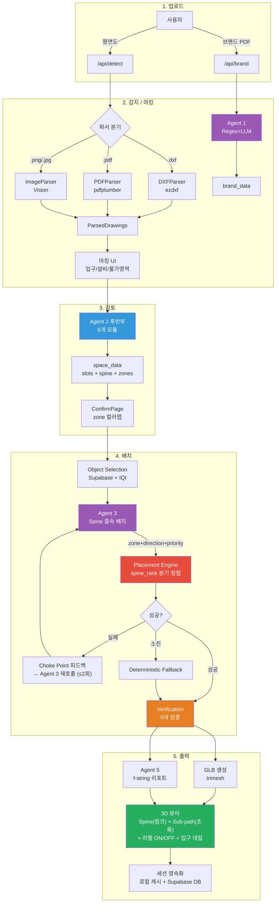
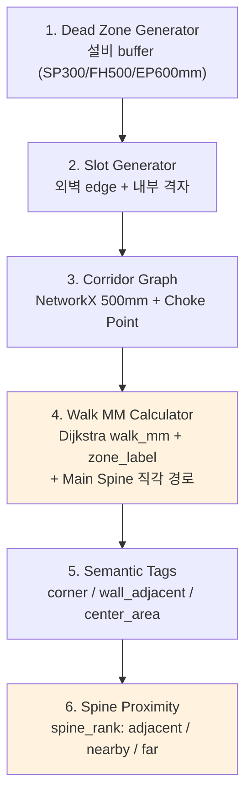
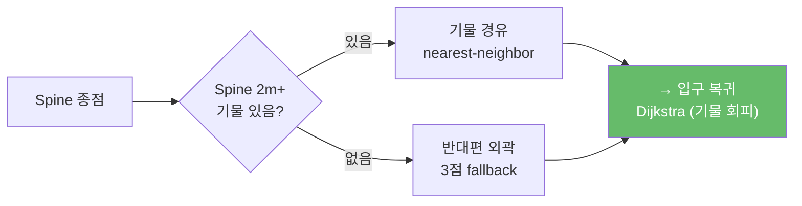
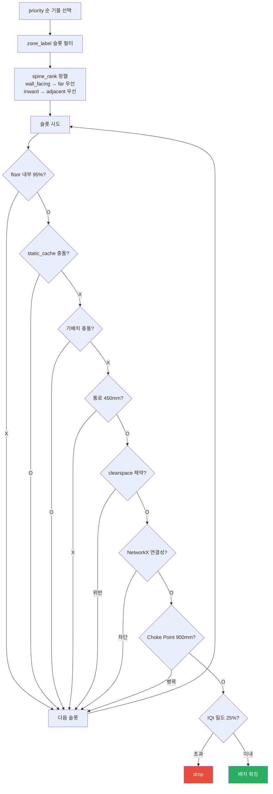
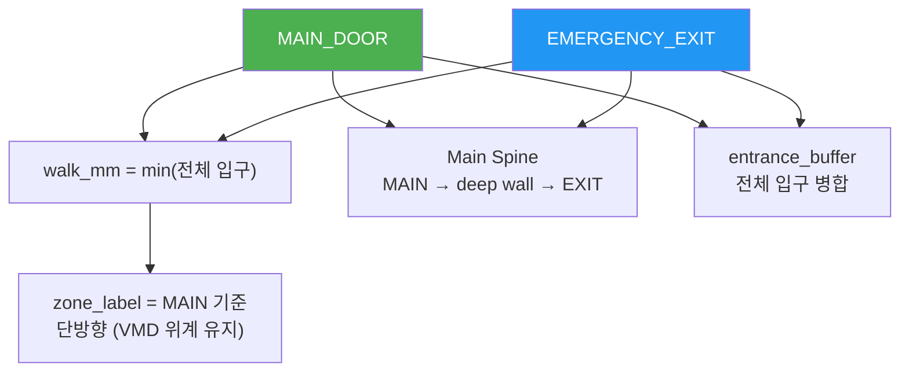
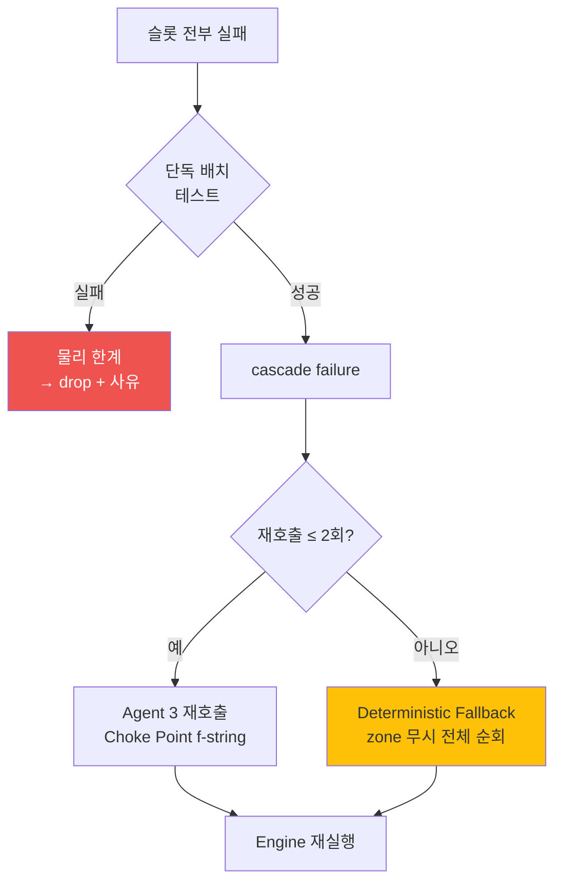
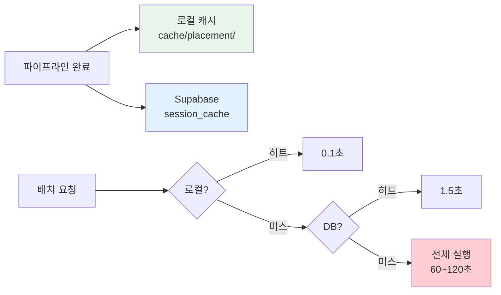

# Rendy — 아키텍처 & 파이프라인 기술 문서 v2

> 팝업스토어 3D 배치 자동화 서비스  
> 최종 갱신: 2026-04-07  
> v1 대비 변경: VMD 주동선 파이프라인, 배치 분산 엔진, 부동선 복귀 루프, 복수 입구, 세션 영속화, 3D UI 강화

---

## 0. 이 프로젝트를 왜 이렇게 만들었는가

### 문제

팝업스토어 공간 배치는 디자이너가 도면을 보고 수작업으로 기물을 배치하는 과정입니다. LLM에게 좌표를 시키면 벽 안에 박히거나, 통로를 막거나, 소방 규정을 위반합니다. LLM은 기하학을 모릅니다.

### 해결: AI-코드 역할 분리 + VMD 동선 선행

```
1. 코드가 주동선(Main Spine)을 먼저 깐다  — 입구 → Deep Wall 직각 경로
2. LLM이 동선을 보고 배치를 기획한다      — "이 캐릭터는 동선 옆 deep_zone에"
3. 코드가 좌표를 계산하고 검증한다         — Shapely 충돌 + NetworkX 통로
4. 코드가 복귀 동선을 후처리한다           — 미커버 기물 경유 루프
```

길을 먼저 닦고, 그 길을 보게 건물을 세우는 것 — VMD(Visual Merchandising Design) 정석.

### 한 장 요약


---

## 1. 기술 스택

| 계층 | 기술 |
|------|------|
| Backend | FastAPI (Python 3.12) |
| Frontend | React + Vite + TypeScript |
| 3D 렌더링 | Three.js (R3F + drei + Html labels) |
| AI | Claude Sonnet 4.5 (Vision + Text) |
| 기하학 | Shapely (충돌/buffer) + NetworkX (경로/통로) |
| 3D 출력 | trimesh (GLB) + InstancedMesh (프론트) |
| DB | Supabase (furniture_standards + session_cache) |
| 파서 | ezdxf (DXF) + pdfplumber (PDF) + OpenCV + Vision (Image) |

---

## 2. 전체 파이프라인



---

## 3. Agent별 역할

### Agent 1 — 브랜드 추출 [LLM + Regex]

```
Input:  브랜드 메뉴얼 PDF
Output: clearspace_mm, prohibited_material, object_pair_rules, ...
방식:   Regex로 수치 추출 → LLM이 라벨링만
```

### Agent 2 전반부 — 도면 감지 [LLM + 코드]

```
Input:  도면 파일 (DXF/PDF/PNG)
Output: ParsedDrawings (floor_polygon_px, entrances, 설비, inner_walls)
방식:   파서 어댑터 4종 → 공통 ParsedDrawings 스키마
```

### Agent 2 후반부 — 공간 분석 [코드 6개 모듈]



### Agent 3 — 배치 기획 [LLM]

```
Input:  공간 요약(50줄) + Spine 구조 + eligible 기물 + 브랜드 제약
Output: Placement[] — zone_label + direction + priority + alignment + placed_because

P1. Power Wall    — 우측 벽면 히어로 배치
P2. Clustering    — 동일 카테고리 군집
P3. Focal Point   — deep_zone 대형 기물
P4. Spine-First   — Hero는 adjacent, 보조는 far 허용

Circuit Breaker: Pydantic 실패 → 최대 3회 재시도
```

### Agent 5 — 리포트 [f-string 템플릿]

```
Input:  배치 결과 + 검증 결과
Output: 마크다운 리포트 (source별 표기, placed_because, 면책)
방식:   LLM 아님 — 기계 조립
```

---

## 4. VMD 동선 시스템

### 4.1 주동선 (Main Spine) — 핑크색


- **단일 입구**: 입구 → 바닥 중심 → deep wall 중앙 (ㄱ자)
- **복수 입구**: MAIN → deep wall 경유 → EMERGENCY (관통 동선)
- **대각선 금지**: 직진 또는 직각만 허용

### 4.2 부동선 (Sub-path) — 초록색



- **100% 생성 보장**: 기물 전부 adjacent여도 외곽 fallback으로 생성
- **기물 footprint 회피**: 배치된 오브젝트를 장애물로 등록 후 그래프 재구축

### 4.3 슬롯-동선 연동

| spine_rank | Spine 거리 | 배치 대상 | 엔진 정렬 |
|-----------|-----------|----------|----------|
| adjacent | ≤ 2m | Hero (캐릭터, 포토존, 메인 매대) | inward/center → 우선 |
| nearby | 2~5m | 진열 선반, 체험 테이블 | — |
| far | > 5m | 배너, 보조 선반 | wall_facing → 우선 |

---

## 5. Placement Engine — 배치 순회



---

## 6. 복수 입구 처리



---

## 7. 실패 처리 계층



---

## 8. 세션 영속화



---

## 9. I/O 스키마

### 9.1 space_data (Agent 2 → Engine)

```python
space_data = {
    "floor": {
        "polygon": Shapely Polygon,
        "usable_area_sqm": float,
        "max_object_w_mm": float,
        "ceiling_height_mm": {"value": 3000, "confidence": "...", "source": "..."}
    },
    "{slot_key}": {
        "x_mm": float, "y_mm": float,
        "wall_linestring": LineString,
        "wall_normal": str,         # north/south/east/west
        "wall_normal_vec": (float, float),
        "zone_label": str,          # entrance_zone / mid_zone / deep_zone
        "walk_mm": float,           # min(전체 입구 Dijkstra 거리)
        "spine_rank": str,          # adjacent / nearby / far
        "spine_dist_mm": float,     # Spine까지 최단 거리
        "shelf_capacity": int,
        "semantic_tags": list[str], # corner / wall_adjacent / center_area / entrance_facing
    },
    "fire": {
        "main_artery": LineString,  # VMD Main Spine (직각 ㄱ자)
    },
    "dead_zones": list[Polygon],
    "entrance_buffer": Polygon,     # 전체 입구 buffer 병합
    "_entrance_coords_mm": list[tuple],  # 모든 입구 좌표
    "_agent3_summary": str,         # 50줄 통계 요약
}
```

### 9.2 Placement (Agent 3 → Engine)

```python
class Placement(BaseModel):
    object_type: str
    zone_label: Literal["entrance_zone", "mid_zone", "deep_zone"]
    direction: Literal["wall_facing", "inward", "center"]
    priority: int
    alignment: Literal["parallel", "perpendicular", "opposite", "none"]
    placed_because: str   # mm값 금지, 동선 종속 의도 명시
    join_with: str | None
```

### 9.3 /api/placement 응답

```python
{
    "placed": list[dict],
    "dropped": list[dict],
    "verification": {"passed": bool, "blocking": [], "warning": []},
    "report": str,
    "glb_base64": str,
    "log": list[str],
    "summary": {"placed_count": int, "success_rate": float, ...},
    "floor_viz": {
        "slots": [{"x_mm", "y_mm", "walk_mm", "zone_label"}],
        "main_artery": [[x, y], ...],     # 핑크 리본
        "sub_path": [[x, y], ...],        # 초록 루프
        "entrances": [[x, y], ...],       # 입구 데칼
        "max_walk_mm": float,
    }
}
```

---

## 10. 3D 시각화

| 요소 | 렌더링 | 색상 |
|------|--------|------|
| Main Spine | CatmullRom 800mm 리본 메시 | 핑크 (0xe91e63) |
| Sub-path | CatmullRom 라인 | 초록 (0x66bb6a) |
| Zone Disc | CircleGeometry 400r | zone별 그라데이션 |
| 입구 마커 | RingGeometry + 십자 LineSegments (바닥 밀착) | 초록 (0x00e676) |
| 오브젝트 라벨 | Html overlay (PascalCase 영어) | ON/OFF 토글 |
| 깊이 정밀도 | logarithmicDepthBuffer (near=10, far=100000) | — |
| 오브젝트 | InstancedMesh (geometry_id 그룹화) | zone별 색상 |

---

## 11. v1 대비 변경 사항 (8건)

| # | v1 (2026-04-03) | v2 (2026-04-07) | 변경 사유 |
|---|----------------|-----------------|----------|
| 1 | Main Artery = Dijkstra 최원점 대각선 | **VMD Main Spine = 직각 ㄱ자** | 대각선은 매장 절반 미커버. VMD 정석은 직각 관통 |
| 2 | Agent 3에 동선 정보 없음 | **P4 규칙 + spine_rank + Spine 구조 주입** | LLM이 동선을 모르면 배치 방향성 없음 |
| 3 | 슬롯 정렬 = walk_mm 오름차순 | **direction 분기: wall_facing→far, inward→adjacent** | 모든 기물이 Spine 좌측에 몰림 방지 |
| 4 | 부동선 없음 | **기물 경유 + 외곽 fallback 복귀 루프 100% 생성** | 단일 입구 매장에서 복귀 경로 필수 |
| 5 | walk_mm 단일 입구 | **복수 입구 min(거리) + zone_label MAIN 기준** | 출구 2개 시 zone 깨짐 방지 |
| 6 | 로컬 캐시만 | **Supabase session_cache DB 영속화** | 서버 재시작 시 배치 소멸 방지 |
| 7 | 3D에 동선/라벨/입구 없음 | **리본+루프+데칼+라벨 ON/OFF** | 배치 검토 불가 |
| 8 | Agent 3 요약 2500줄 | **50줄 통계 + 대표 샘플** | rate limit + 토큰 비용 |

---

## 12. 파일 구조 (37 Python + 15 TS)

```
backend/app/
├── agents/
│   ├── agent1_brand.py          # Agent 1: Regex+LLM 브랜드 추출
│   ├── agent2_back.py           # Agent 2 후반부: 6모듈 오케스트레이터
│   ├── agent2_summary.py        # Agent 3용 50줄 통계 요약
│   ├── agent3_placement.py      # Agent 3: P1~P4 규칙 LLM 배치
│   ├── corridor_graph.py        # NetworkX 500mm 격자 + Choke Point
│   ├── dead_zone_generator.py   # 설비 buffer + inaccessible
│   ├── slot_generator.py        # edge + interior 슬롯 생성
│   └── walk_mm_calculator.py    # Dijkstra + Main Spine + 복수 입구
├── api/
│   ├── routes.py                # 10개 엔드포인트
│   ├── pipeline.py              # 파이프라인 + 부동선 + floor_viz
│   ├── session_store.py         # Supabase session_cache
│   ├── cache_service.py         # 로컬 파일 캐시
│   ├── file_converter.py        # DXF→PNG 프리뷰
│   ├── object_crud.py           # furniture_standards CRUD
│   └── serializer.py            # Shapely → JSON
├── modules/
│   ├── placement_engine.py      # spine_rank 분기 정렬 + 8단계 검증
│   ├── calculate_position.py    # 좌표 + wall snap
│   ├── verification.py          # 5대 규정 검증
│   ├── report_generator.py      # Agent 5 f-string
│   ├── glb_exporter.py          # trimesh → GLB + PBRMaterial
│   ├── object_selection.py      # IQI 밀도 25% + Supabase
│   ├── failure_handler.py       # cascade + fallback 오케스트레이터
│   ├── failure_classifier.py    # 병목/슬롯부족 분류
│   ├── fallback_placement.py    # zone 무시 강제 배치
│   └── geometry_cache.py        # InstancedMesh geometry_id
├── parsers/
│   ├── base.py                  # FloorPlanParser 추상
│   ├── dxf_parser.py            # ARC/CIRCLE/bulge/TEXT 파싱
│   ├── dwg_parser.py            # ODA 경유
│   ├── image_parser.py          # OpenCV + Vision
│   ├── pdf_parser.py            # pdfplumber 벡터
│   └── factory.py               # 확장자 분기
└── schemas/
    ├── drawings.py, placement.py, space_data.py, verification.py, brand.py

frontend/src/
├── App.tsx                      # 4단계 탭 + 상태 관리
├── api/
│   ├── detect.ts, placement.ts  # API 호출 + 타입
├── components/
│   ├── upload/UploadPage.tsx
│   ├── marking/MarkingPage.tsx + useMarkingCanvas.ts + ScaleAnchorManager.tsx
│   ├── confirm/ConfirmPage.tsx
│   ├── placement/PlacementPage.tsx
│   └── viewer/SceneViewer.tsx + useGLBScene.ts + useSceneInteraction.ts
```

---

## 13. 남은 작업

| 순위 | 항목 | 상태 |
|------|------|------|
| 1 | PBR 조명 (MeshStandardMaterial) | 대기 |
| 2 | Agent 4 (레퍼런스 참고 + zone 내 재배치 + 동선 최적화) | 미착수 |
| 3 | E2E deterministic 테스트 (Agent 3 mock) | 대기 |
| 4 | 배포 설정 | 대기 |
| 5 | DXF 설비 심볼 매핑 | 실 데이터 필요 |
| 6 | step_mm / zone 임계값 실측 | 실 도면 필요 |

---

## 14. 테스트 결과 (2026-04-07)

```
E2E:              PASS
배치 성공률:       16/16 (100%)
Verification:     PASS (0 blocking, 0~1 warning)
Fallback:         미사용
Main Spine:       ㄱ자 직각 (4 경유점, 239 노드)
Sub-path:         기물 경유 루프 (100% 생성)
세션 영속화:       DB 저장/복원 정상 (1.46초)
캐시 히트:         0.1초 (LLM 0회)
```
